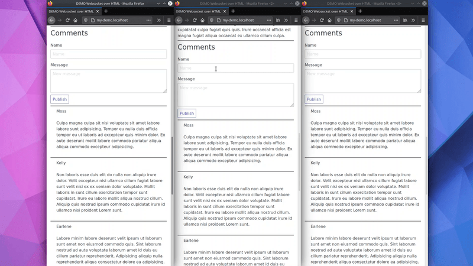

# Demo: HTML over WebSockets in Django

Demonstration of how to build a real time application using HTML over WebSockets in Django 


### Broadcast



## Article that inspired

https://alistapart.com/article/the-future-of-web-software-is-html-over-websockets/

## Explanation

### Spanish

https://programadorwebvalencia.com/html-sobre-websockets/

https://www.youtube.com/watch?v=02IjScPlDH0

### English

https://testdriven.io/blog/html-over-websockets/

## Run demo

``` bash
docker-compose -f docker-compose.dev.yaml up -d
```

Open

``` bash
my-demo.localhost
```

## Load fake data

``` bash
docker exec -it demo-html-over-websockets-in-django_django_1 python3 manage.py loaddata comments.json
```

# Interesting projects using this technique

## Integrated with Django

- [django reactor](https://github.com/edelvalle/reactor): LiveView library for Django.
- [django sockpuppet](https://github.com/jonathan-s/django-sockpuppet/): Inspired by a ruby project (stimulus/reflex).

## Without Django:

- [idom](https://idom-docs.herokuapp.com/docs/index.html): HTML is generated using a Python syntax.
